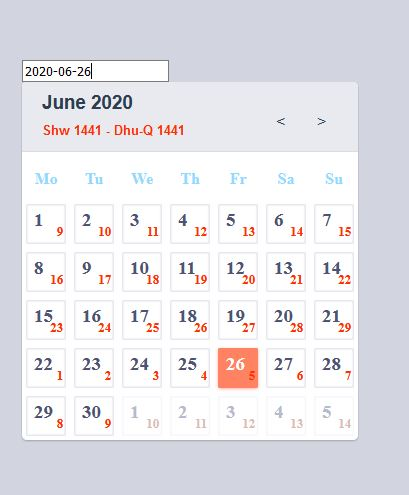
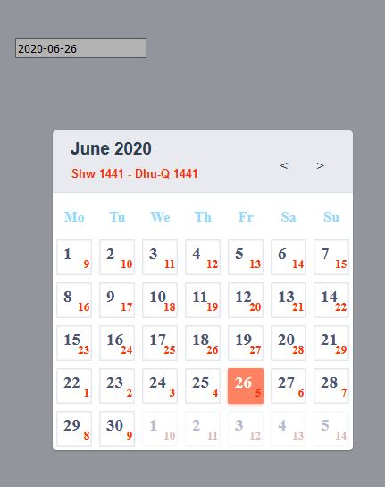

# Hj Calendar ( Vue.js )

## Description
It‘s just a simple project for helping us to pick certain Hijri-Date based on Gregorian Calendar
### Screenshots

### Using
[Calendar template](https://codepen.io/yy/pen/GrKLt)
[moment-hijri](https://github.com/xsoh/moment-hijri)

